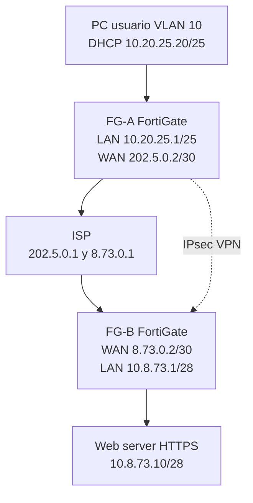
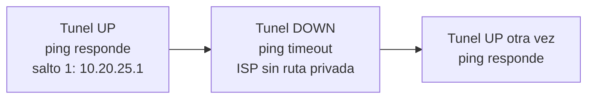

# Infraestructura 1: VPN site-to-site entre dos FortiGate

## Video

https://youtu.be/MeZDB0Oo9v4

Matricula: **2025-0873**

## Diagrama

Diagrama descargable: [diagramas/topologia.svg](diagramas/topologia.svg)

## Objetivo

Comunicar el usuario con el servidor web a traves del enlace VPN y comprobar que esa comunicacion solo fluye si el tunel esta activo.

## Topologia

- ISP: Ubuntu, solo enruta las IP publicas.
- FG-A: FortiGate del sitio de usuarios. VLAN 10, DHCP y NAT de salida.
- FG-B: FortiGate del sitio del servidor.
- PC-User: VPCS, cliente DHCP.
- WEB-SRV: servidor HTTPS.

La VPN no tiene cable propio. Es un tunel IPsec entre `202.5.0.2` y `8.73.0.2`.

## Direccionamiento

| Equipo | Interfaz | IP |
|---|---|---|
| ISP | ens3 | 202.5.0.1/30 |
| FG-A | port1 WAN | 202.5.0.2/30 |
| ISP | ens4 | 8.73.0.1/30 |
| FG-B | port1 WAN | 8.73.0.2/30 |
| FG-A | port2 LAN | 10.20.25.1/25 |
| PC-User | e0 | DHCP 10.20.25.20-100/25 |
| FG-B | port2 LAN | 10.8.73.1/28 |
| WEB-SRV | ens3 | 10.8.73.10/28 |

Trafico interesante: `10.20.25.0/25` hacia `10.8.73.0/28`.

